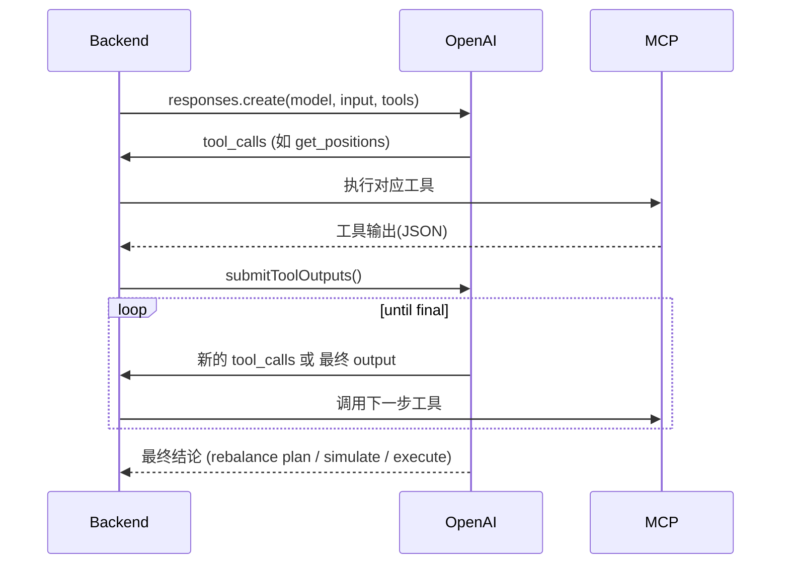

# DeFi-AI Agent 架构设计文档（基于 OpenAI Agents SDK + Responses API）

## 概述

本系统是一个 **DeFi 自动调仓与收益优化 Agent 平台**，目标是为用户在多协议（AAVE、EULER、Uniswap V3、Aerodrome CL 等）上提供自动化收益策略与仓位再平衡。

系统采用 **后端驱动架构**，所有与 OpenAI Agent 的交互均由后端发起。  
Agent 本身通过 MCP 工具访问链上仓位与策略模块，实现：

1. 分析用户的 lending / LP 仓位；
2. 找出更优 APR 策略；
3. 仿真与评估；
4. 自动执行（在风险阈值内）。

---

## 架构总览

```
+---------------------------+
|         前端 Web          |
|---------------------------|
| - 钱包授权 / 查看仓位     |
| - 调仓结果可视化          |
| - 自动调仓开关 / 风控设置 |
+---------------------------+
              |
              v
+---------------------------+
|         后端 API          |
|---------------------------|
| - 调用 OpenAI Agent       |
| - 执行 MCP 工具           |
| - 审核仿真 → 执行路径     |
| - 风控、任务调度、监控    |
| - 日志 / 审计 / 通知      |
+---------------------------+
              |
              v
+---------------------------+
|        MCP Server         |
|---------------------------|
| - get_positions            |
| - analyze_yields           |
| - plan_rebalance           |
| - simulate                 |
| - execute_steps            |
| - quote_* 工具（选配）     |
+---------------------------+
              |
              v
+---------------------------+
|     链上协议 (DeFi)       |
|---------------------------|
| AAVE / EULER / UNIV3 / ACL|
+---------------------------+
```

---

## 模块说明

### 1. 前端层
- **作用**：展示数据、触发操作、展示执行结果。
- **特点**：不直接与 Agent 通信，只调用后端 REST API。
- **主要页面**：
  - 仓位与 APR 查看
  - 策略预览与调仓报告
  - 风控设置
  - 自动调仓状态
  - 历史任务与交易追踪

---

### 2. 后端层（核心逻辑）
后端是唯一与 Agent 通信的模块，负责安全、风控与调度。

#### 功能
- 负责发起 `Responses API` 请求；
- 解析 Agent 的 tool 调用；
- 连接 MCP Server；
- 执行监控任务与触发再平衡；
- 做最终风控审核（仿真 → 执行闸门）；
- 存储执行记录与日志。

#### 核心模块
| 模块 | 功能 |
|------|------|
| **agent.ts** | 定义系统提示、Agent 约束与 tool spec |
| **mcpClient.ts** | 调用自建 MCP server 工具接口 |
| **runAgent.ts** | 实现 Responses + tool 回路 |
| **guard.ts** | 审核仿真输出，判断是否可执行 |
| **monitor.ts** | 定时检测 APR、LP out-of-range 并触发任务 |
| **api/** | 对前端提供 `/positions`, `/preview`, `/execute` 等接口 |

---

### 3. MCP 层（工具服务）
封装链上数据读取、收益分析与交易执行逻辑，Agent 通过后端的工具代理调用。

| 工具名 | 功能 |
|--------|------|
| `get_positions` | 查询用户当前 lending / LP 仓位 |
| `analyze_yields` | 分析收益率与潜在提升空间 |
| `plan_rebalance` | 生成再平衡执行计划（路径与步骤） |
| `simulate` | 仿真执行计划，计算净收益、Gas、滑点、健康因子变化 |
| `execute_steps` | 实际执行交易（上链） |
| `quote_swap` / `quote_borrow` | 可选：报价子模块，用于动态评估策略可行性 |

---

## Agent 设计

### System Prompt

```text
你是一个严格遵守风控的 DeFi 再平衡 Agent。
仅允许在白名单协议（AAVE/EULER/UniswapV3/AerodromeCL）上操作。
必须遵守：
- 执行流程：Plan → Simulate → Execute。
- simulate 阶段净收益 >= 用户设定阈值。
- APR 提升 >= 最小阈值。
- Health Factor >= 用户要求。
- 滑点、Gas、金额受限。
禁止未授权资产、跨用户访问、非白名单协议调用。
```

---

### 工具定义（TOOL_SPEC）

| 工具名 | 描述 |
|--------|------|
| `get_positions` | 获取链上仓位 |
| `analyze_yields` | 评估潜在收益 |
| `plan_rebalance` | 生成执行计划 |
| `simulate` | 仿真评估计划 |
| `execute_steps` | 实际执行调仓 |

---

### 调用流程（Responses 循环）



---

## 风控设计

### 审核逻辑
1. **强制仿真阶段**
   - 禁止直接执行 `execute_steps`；
   - 必须先输出 `simulate` 报告。
2. **后端二次审批**
   - 检查净收益、APR 提升、滑点、健康因子；
   - 满足条件才执行；
   - 否则拒绝执行并记录原因。
3. **执行审计**
   - 每笔执行记录存档；
   - 失败自动回滚（如撤销授权、恢复仓位）。

### 风控参数（每用户配置）
| 参数 | 说明 |
|------|------|
| `min_apr_lift_bps` | 最小收益提升阈值 |
| `min_net_usd` | 最小净收益（USD） |
| `min_health_factor` | 最小健康因子 |
| `max_slippage_bps` | 最大滑点 |
| `max_gas_usd` | 单笔最大 Gas 成本 |
| `max_per_trade_usd` | 单笔最大交易额 |
| `auto_enabled` | 是否开启自动调仓 |

---

## 调仓任务调度

### 监控指标
- **LP out-of-range**：价格超出区间、流动性无效；
- **低收益借贷仓位**：借贷 APR 低于基准；
- **激励衰减**：奖励代币年化下降；
- **风险预警**：健康因子下降。

### 执行流程
```
[定时任务] → 检测仓位 → APR < 阈值 or LP out-of-range
      ↓
[构建上下文] → 调用 Agent (Responses API)
      ↓
Agent 调用 MCP：get_positions → analyze → plan → simulate
      ↓
[后端审核 approve(sim)]
      ↓
通过 → MCP.execute_steps() 上链
不通过 → 记录原因 / 通知用户
```

---

## 数据与日志结构

### 表结构（示例）

```sql
CREATE TABLE user_policies (
  user_id TEXT PRIMARY KEY,
  chains TEXT[],
  asset_whitelist TEXT[],
  min_apr_lift_bps INT,
  min_net_usd NUMERIC,
  min_health_factor NUMERIC,
  max_slippage_bps INT,
  max_gas_usd NUMERIC,
  max_per_trade_usd NUMERIC,
  auto_enabled BOOLEAN DEFAULT false
);

CREATE TABLE rebalance_jobs (
  id UUID PRIMARY KEY,
  user_id TEXT,
  trigger TEXT,
  input_context JSONB,
  simulate_report JSONB,
  exec_result JSONB,
  status TEXT,
  created_at TIMESTAMP DEFAULT now()
);
```

---

## 安全与合规

- **非托管优先**：使用 Permit2 / ERC-4337 session key 授权；
- **托管模式**：如需服务器签名，使用 HSM/KMS；
- **幂等性**：`idempotencyKey` 保证每笔执行唯一；
- **审计与回放**：存档每次 Agent 输入 / 输出 / 仿真结果；
- **人工复核阈值**：大额调仓需人审；
- **隐私保护**：仅存结构化结果，不保存 reasoning trace。

---

## 未来扩展方向

| 模块 | 扩展思路 |
|------|-----------|
| **更多协议** | Compound、Morpho、Curve、Velodrome 等 |
| **Agent 协同** | 拆分收益策略 Agent / 风控 Agent / 执行 Agent |
| **实时推送** | 结合 WebSocket / Telegram Bot 提示 |
| **Prompt 自动优化** | 收集仿真-实盘偏差，自动评估 Agent 准确率 |
| **多租户管理** | 隔离每个用户的上下文与任务队列 |

---

## 小结

本方案实现：
- 完全后端控制；
- 工具调用闭环；
- 风控与仿真先行；
- 可安全扩展至多协议；
- 满足生产级可观测性与审计要求。

技术栈推荐：
- **Agent 层**：OpenAI Responses API + Agents SDK
- **服务层**：Node.js + TypeScript + BullMQ + Axios
- **MCP 层**：FastAPI / Express / NestJS
- **数据库**：Postgres + Redis
- **监控**：Prometheus + Grafana

---

**Author:** 张兰西  
**Date:** 2025-10-09  
**Version:** 1.0.0
